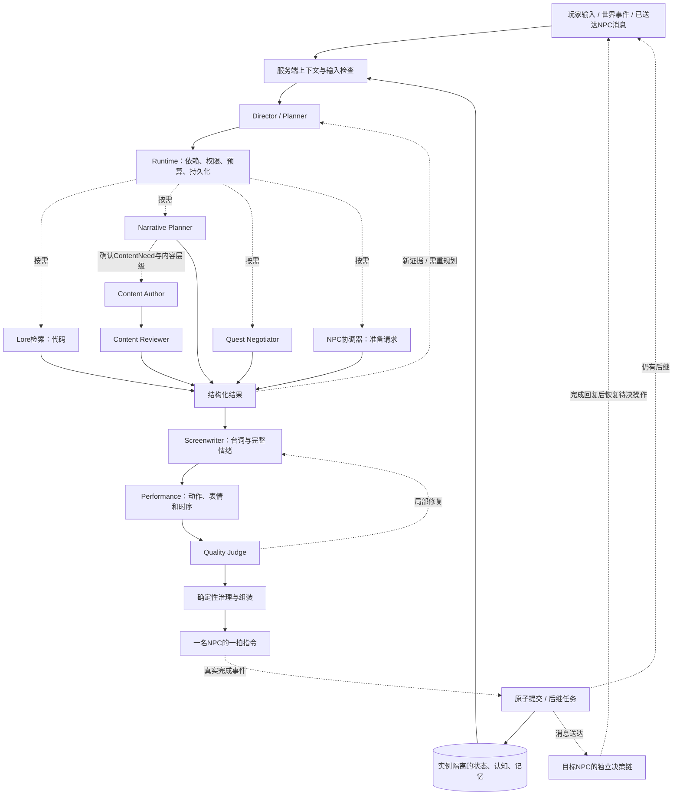
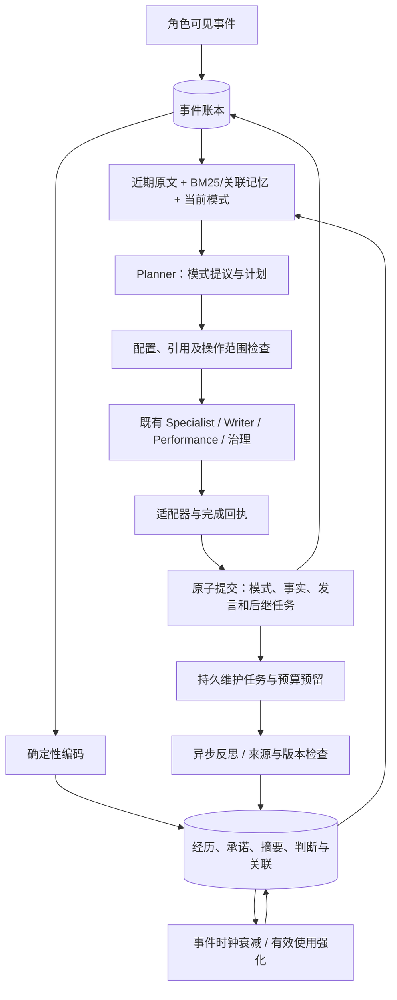

# NPC Director 架构升级：事件驱动、多 NPC 协作与可审核叙事

默认 `bounded` 链路以 `TurnAnalysis` 理解复合请求，编译有依赖的 `ExecutionPlan`。
模型提出语义计划；Runtime 负责权限、依赖、预算、状态、知识可见性和完成事件。
`react` 保留为旧 ReAct 消融路径。原型和 Unity 的接入代码不在本次修改范围内。



## 可选认知链：持续模式与记忆生命周期

`NPC_DIRECTOR_COGNITION=true` 为新 episode 固定 `memory-v1` 版本；旧 episode 保留原版本。
详见 [完整说明](COGNITION.md)。前台继续使用原有 Planner/Specialist/治理及完成链。
模式选择复用 Planner，编排操作与游戏动作目录分开；角色模式不会扩大任何权限。
后台只产生带来源的私有摘要和人物判断，不直接写入世界事实或产生新的行动。



模式切换使用仅限当前角色可见范围的短引用，入库时恢复正式 ID；无效模式提议保留在 trace 中，
维持旧模式继续检查计划，不把不相关的元数据错误变成泛化拒答。操作范围违规仍阻断执行。
旧模式、任务和承诺不会因模型输出了一个完成词语而自动结束。

## 角色与调度

- **Director / Planner** 保留主意图作为摘要，同时识别多个言语行为、条件、目标和缺失信息。
  支持明确的检索、剧情规划、谈判、协作、创作及重规划操作；依赖环或未知依赖会被拒绝。
  Runtime 补齐输出节点，并把依赖 NPC 咨询答复的操作保存在 `ExecutionPlan.deferred_nodes`。
  当前拍只能准备和发出询问，不能把“已安排咨询”当作“已经得到答案”继续做依赖决策；
  真实送达及回复事件驱动后续 NPC 回合与恢复规划。
- **Narrative Planner** 获得原话、历史、人物动机与检索证据，生成 beats、任务粒度、步骤与事件。
  内容创作前先由 Narrative 判定 scope 和 `ContentNeed`。已有任务步骤引用本实例目标及版本；
  新支线内部引用只使用候选自己的临时命名空间，正式 ID 由 Runtime 分配。
  目标版本来自目标注册表，不使用某个 NPC 的整体领域版本；关系变化不会改变共同任务定义的版本。
  复用既有内容生成的 `ObjectiveStep/ObjectiveEvent` 在发言完成事务中按父目标保存，并供后续
  回合检索；它们记录计划定义，不代表步骤已执行。新增内容仍只经过 Author/Reviewer 发布路径。
- **Quest Negotiator** 返回条款与未决问题，再回到计划；新的默认链不再由谈判直接接管整份输出。
- **Screenwriter / Performance** 分别拥有台词及情绪、演出 cues。情绪不再由 intent 强制映射。
- **Quality Judge** 独立检查复合请求覆盖、人设、自然度、重复、证据表达与演出。
  措辞问题只修台词及下游，演出问题只修演出；事实或规划错误使相应依赖失效。
- **Content Author / Reviewer** 为新增角色。Author 按需生成内容；Reviewer 独立审核。
  Reviewer 可读取额外硬设定，但这些审校材料不进入 Author、Writer 或其他 NPC 的上下文。

`build_default_service()` 同时装配持久 episode、内容仓库、角色注册表及预算观察器。
只替换模型 transport 的测试仍经过同一条 Runtime 和完成链；无事件时不调用模型。

## 多 NPC、记忆与事实边界

`session_id` 是游戏实例。NPC 状态、长时记忆、知识、关系及生成内容均按实例隔离。
服务端保留最近 12 条可见对话，并维护指代、未答问题、承诺、待办及情绪。
长期记忆在本实例、本 NPC 的最多 256 条候选中按当前输入与话题做 BM25 检索，
去除已在最近原文中的重复项后，最多注入四条并保留真实来源回合；不重复塞进历史摘要。
客户端历史是未核验补充，不进入权威事实或长期记忆蒸馏来源。

协作对象必须来自服务端当前场景名册。每名 NPC 只拿自己的完整资料，其他角色只以公开名册出现。
发言完成后才投递消息和触发对方回应；收到的信息保留来源，按转述处理，不自动成为世界真相。
已加入同一交谈的角色能听到完成的前台发言；仅出现在候选名册中的角色不会因此知情。
协调者已排队汇总时，不因中间角色收到同一回复再次唤起它；发言和知识送达仍正常记账。
公开内容可访问不代表 NPC 已知；仍按所属角色或有效知情记录投影。

NPC 对玩家与对其他 NPC 的关系分别存储。符合人设及动机的隐瞒和谎言可以进入角色表达，
有意谎言仍作为角色说法保存，不能被发布成世界事实。`KnowledgeClaim` 保留来源和认知状态，
默认是 `reported`；可信世界事件提供的 claim 不因 `origin=world_event` 自动成为已核实真相。
NPC 转述以及新发布内容的摘要按 `reported` 保存；新创作内容中，只有显式审核的 `world_fact` 可进入正式事实。

## 可审核叙事与任务粒度

| 级别 | 归属 |
|---|---|
| action | 当前计划中的一个操作 |
| step | 现有目标的前置或中间步骤 |
| task_event | 改变现有任务路径、代价或选择的事件 |
| side_quest | 具有独立目标、人物动机、结束条件及结果的可选任务 |

距离、步骤数量、标题、接取按钮或奖励均不能证明独立性。五米外取扳手可只是一个行动；
同一房间里的遗物归还也可以因独立人物关系与选择而成为短支线。

先判断已有内容是否足够，再由 Narrative 确认 `ContentNeed` 与层级。Reviewer 可以接受、归入父任务、合并、
定向改写或拒绝。每个 episode 默认至多新建一条支线；重试和子回合共享原子预留额度。

修订最多一次，并重新经过独立审核。Reviewer 的 `revision_edits` 只包含固定编辑代码和指向
原候选的 JSON 字段路径；Runtime 校验路径、按 Author 可见的 policy 核对能力，再生成固定反馈。
私密 `reasons`、`revision_instructions` 和补充硬设定不会转发给 Author 或 Writer。
修订既不能改变原目标及权限，也不能免除支线独立性要求。对话确认接收意愿与实际物品交付分别判断，
`quest_transition` 不授权任意路线或世界状态；候选只定义未来步骤和可观察的完成条件。

内容先进入候选和审核，再暂存服务端分配的 ID 及精确状态路径。Writer 可以介绍已审核的暂存内容，
真实完成事务才发布。发布仅为 offered，接受和完成分别推进；失败或中断不会发布完整候选。

## 接口、恢复与预算

原 `run_turn(TurnRequest, adapter)` 与 `PerformanceDirective 1.0` 保持兼容。
新增 Python 接口 `start_episode`、`publish_event`、`get_episode` 和 `cancel_episode`。
`publish_event` 接受可信世界事件；NPC 消息只能由已完成的发言产生，不能由客户端伪造。

每次状态提交同时处理领域变化、发言、知识、内容发布和后继任务。重复事件不重复产生副作用。
记忆蒸馏在事务外运行，失败作为派生任务重试，不撤销已经完成的事实。
新玩家输入优先取消过时任务；已发出的演出等待真实完成或中断回执。
旧全局数据保留在 legacy 表，新实例不自动继承；旧回合沿原策略恢复。

默认预算为 4 名参与 NPC、6 次自主发言、32 个计划节点、32 次模型调用、2 次重规划、
每节点一次语义修复、96,000 token 和 180 秒主动计算时间。等待回执不计主动计算时间。
节点记录与预算持久化；调用前预留，实际消耗与失败也计入。旧 wire 的 specialists 列表仍只
总结兼容角色，完整模型调用与审核记录以内部 execution trace 为准。

`tiktoken` 估算输入、指令和 schema 的 token，并预留安全余量及本节点输出额度；离线词表不可用时
回退到保守 UTF-8 字节上界。预留时使用的输出上限与实际模型调用一致，不能只限制账本而让请求无限输出。
`NPC_DIRECTOR_MAX_OUTPUT_TOKENS` 默认 4096，各节点再取更小上限：台词 1536、演出 1024、
质量判断和谈判 2048、Narrative 与内容审核 3072；其他节点使用配置值。

结构化输出始终以 Pydantic 校验为准。`NPC_DIRECTOR_INLINE_OUTPUT_SCHEMA=auto` 时，原生
`gpt-` 模型默认使用原生 schema，其他模型额外在指令中携带紧凑 schema；可用 `true`/`false` 覆盖。
`NPC_DIRECTOR_PROMPT_JSON_SCHEMAS` 默认 `NarrativePlan`，逗号分隔的指定契约改用提示中的 JSON
schema 与返回后的严格校验，避免嵌套契约在部分约束解码器上停滞；设为空可禁用这一指定列表。
该模式下 schema 不会在预算中重复计算。格式失败最多进行本节点一次格式修复，修复调用也受总预算约束。

## 不依赖 Unity 的验证

```bash
.venv/bin/python -m pytest
.venv/bin/python -m scripts.run_episode_eval --mode recorded --repeats 3
.venv/bin/python -m scripts.run_episode_demo --mode recorded
.venv/bin/python -m scripts.run_episode_eval --mode live --repeats 3
```

当前 [多轮用例集](eval/cases/episodes.jsonl) 有 34 个场景，默认各重复 3 次，共 102 次执行。
覆盖复合请求、记忆、私有知识、协商、事件、故障恢复以及 8 类任务粒度案例。
recorded 仅替换模型 transport，仍走生产服务、治理、暂存及完成事件；它只证明编排与状态约束，
`quality` 与 `goal_passed` 保持空值。live 使用独立整段对话 Judge；失败或降级的运行保留在分母内，
fallback 单独统计，目标成功率与自然度不以 schema 通过率代替。
报告包含逐例对话、调用摘要、执行计划与 trace、最终认知/状态、内容及用量；写入新的
`artifacts/director-v2/` 文件，不覆盖历史模型报告。完成报告中的结果才用于质量结论。

## 附录：垂直切片 Real 入口（既有原型接入）

以下保留原型域适配和历史阶段门的实现说明。上文的后端 episode 验证不依赖该入口，
本次后端升级也没有修改 Unity 或原型代码。

P3/垂直切片的 Real 模式不得把“调用了真实模型”当成“调用了生产编排”。默认路径固定为：

```text
Unity / Mock Unity
  → PrototypeRealDirectorSession
  → Scene Action Planner（只拥有游戏域动作候选）
  → ResilientDirectorExecutor
  → BoundedDirectorExecutor
  → Semantic Router / Specialists / Deterministic Assembler
  → PrototypeRealGovernance
  → PrototypePuzzleRules
  → Unity scene action + completed 后提交
```

Scene Action Planner 是原型域适配器，只能填写 `PrototypeSceneActionProposal`；它不能生成最终
台词、演出或状态补丁。最终 `PerformanceDraft` 必须来自受约束生产编排，场景动作仍须通过
知识治理与确定性谜题规则。运行报告必须记录 `executor_chain`、`specialists_called` 和
`routing_trace`；P3/P4 阶段门只有在 `production_orchestration=true` 时才接受 Real 证据。

`OpenAIPrototypeTurnGenerator` 和对应 Codex 单调用适配仅为历史报告复现保留，不再作为 P3
默认路径，也不能单独产生新的 P3/P4 通过证据。
