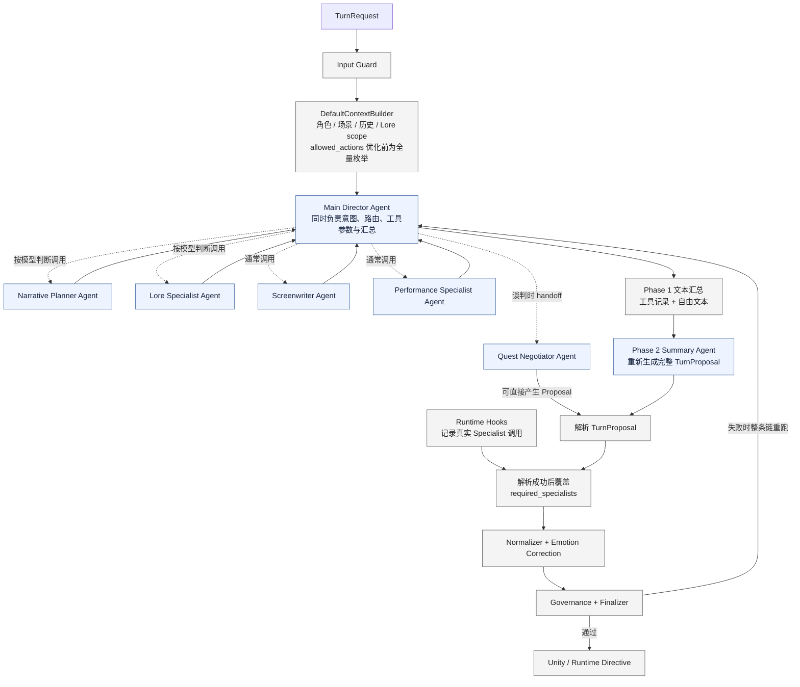
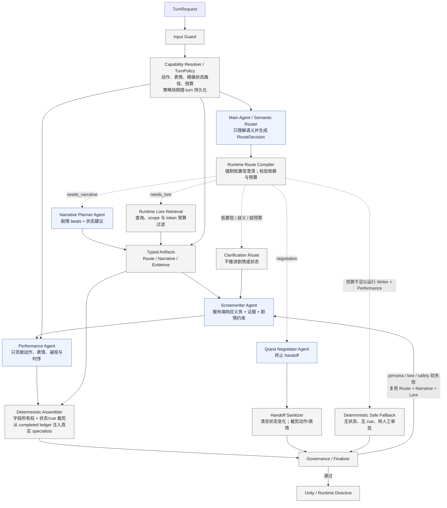

# NPC Director Agent 架构对比

相较 legacy ReAct 路径，生产流程骨架更确定，但没有变成固定流水线：Main Agent 仍根据语义
决定所需能力并生成 Lore 查询；Runtime 负责权限、依赖顺序、预算、状态和普通分支的最终组装。

## 优化前 / legacy 结构（Idealab two-phase 路径）



这条 legacy 路径的自由度集中在 Main Director 的 ReAct 循环中，但它也同时承担分类、路由、
参数拼装和最终语义汇总。因此自由度较高，运行路径却容易受模型和网关行为影响；阶段二还
可能重写阶段一的专家结果。仓库保留该路径用于 `react` 消融，生产默认不再使用。

## 优化后结构（受约束的动态 main-sub）



优化后的确定性主要体现在安全边界和数据流，而不是业务语义：

- **仍然动态**：Main Agent 通过 `RouteDecision` 决定是否需要 Lore、Narrative 或 Negotiator，
  并生成目标、查询与约束；它不直接执行任意子图。
- **变得确定**：Runtime 校验调用权限、依赖顺序和预算；状态路径与真实调用轨迹不再由模型
  自报。谈判分支由 Runtime 直接运行 Negotiator，再经过专用 sanitizer，而非普通 Assembler。
- **保留创作自由**：查询设计、剧情 beats、台词、情绪和允许范围内的演出仍由各 Specialist 生成。
- **局部恢复**：persona、Lore 或 safety 软失败时复用已完成的 Router、Narrative 与 Lore，
  只重跑 Screenwriter 和 Performance；该复用是单进程、单 executor 实例内的有界 LRU 缓存，
  其他反馈或实例切换会完整重路由以避免错误复用。

这仍然是 main-sub agents，只是从“Main Agent 自由执行所有控制流”转为“Main Agent 提出动态
语义需求，Runtime 在可信边界内执行”。它描述的是架构约束，不要求必须使用 LangGraph；
普通代码、Agents SDK 或 LangGraph 都可以实现。

## 垂直切片 Real 入口

P3/垂直切片的 Real 模式不得把“调用了真实模型”当成“调用了生产编排”。默认路径固定为：

```text
Unity / Mock Unity
  → PrototypeRealDirectorSession
  → Scene Action Planner（只拥有游戏域动作候选）
  → ResilientDirectorExecutor
  → BoundedDirectorExecutor
  → Semantic Router / Specialists / Deterministic Assembler
  → PrototypeRealGovernance
  → PrototypePuzzleRules
  → Unity scene action + completed 后提交
```

Scene Action Planner 是原型域适配器，只能填写 `PrototypeSceneActionProposal`；它不能生成最终
台词、演出或状态补丁。最终 `PerformanceDraft` 必须来自受约束生产编排，场景动作仍须通过
知识治理与确定性谜题规则。运行报告必须记录 `executor_chain`、`specialists_called` 和
`routing_trace`；P3/P4 阶段门只有在 `production_orchestration=true` 时才接受 Real 证据。

`OpenAIPrototypeTurnGenerator` 和对应 Codex 单调用适配仅为历史报告复现保留，不再作为 P3
默认路径，也不能单独产生新的 P3/P4 通过证据。
