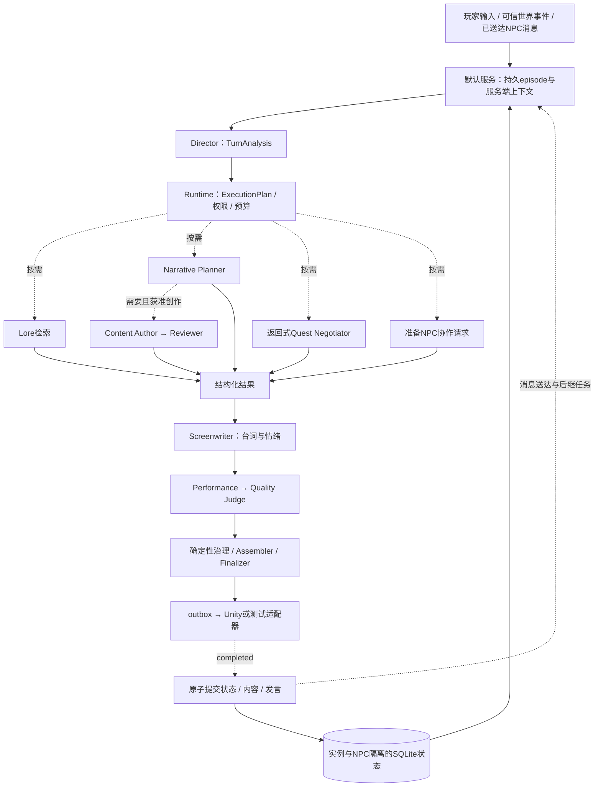

# NPC Director

面向 Unity 的 NPC 演出编排系统。Director / Planner 使用 OpenAI Agents SDK 理解复合请求，
输出 `TurnAnalysis`，由 Runtime 编译并执行 `ExecutionPlan`。后端按需调用剧情、Lore、
谈判、多 NPC 协作、内容创作与审核，再生成台词、情绪和演出；确定性 Workflow 负责权限、
预算、组装、安全、HITL、状态提交、回放、outbox 和引擎副作用。

本文档同时是面向游戏研发工程师的**接入操作手册**，按以下顺序阅读即可独立完成系统接入：

1. [项目概述](#1-项目概述)
2. [系统架构](#2-系统架构)
3. [集成指南](#3-集成指南)
4. [配置说明](#4-配置说明)
5. [开发流程](#5-开发流程)
6. [测试验证](#6-测试验证)
7. [部署指南](#7-部署指南)

---

## 架构升级与多轮验证

默认 bounded 已升级为事件驱动的 Director / Planner，按需执行检索、剧情、返回式谈判、
多 NPC 协作和内容创作审核，再进行台词、演出及质量检查。完整说明、结构图和预算见
[架构设计](AGENT_ARCHITECTURE.md)。调用 `build_default_service()` 获得带实例隔离和持久
episode 的默认服务；单独调用 executor 只生成一拍，不替代完成事件与世界状态提交。

```bash
.venv/bin/python -m scripts.run_episode_eval --mode recorded --repeats 3
.venv/bin/python -m scripts.run_episode_demo --mode recorded
.venv/bin/python -m scripts.run_episode_eval --mode live --repeats 3
```

原接口与 PerformanceDirective 1.0 保持兼容。新增 `start_episode`、`publish_event`、
`get_episode`、`cancel_episode` 为后端 Python 接口；无需 Unity 可运行测试适配器。
当前多轮用例为 **34 个场景 × 3 次重复 = 102 次执行**。recorded 验证编排与状态约束，
live 质量只以完整独立评审报告为准。下文 M0–M6、36 条 golden 和原型 P3 说明保留为历史基线，
不代表当前默认后端的验收结果。

本次升级的 [验收记录](VALIDATION_DIRECTOR_V2.md) 汇总了 460 项测试、完整 102 次真实评测、
最后修正后的 27 次内容回归及已知失败；真实评测成功率为 95.10%，自然度/人设均值为 4.59/4.91。
评分单位、实际门槛与未完成人工标定的限制见 [评分标准](EVALUATION_STANDARDS.md)；
实施中走过的弯路、根因、修复和回归证据见 [统一问题与复盘记录](ISSUE_LOG.md)。

## 1. 项目概述

### 1.1 项目定位

NPC Director 让游戏中的 NPC 具备"由 AI 导演编排"的对话与演出能力：玩家输入一句话，
后端多 Agent 系统产出一条结构化的**演出指令（PerformanceDirective）**——包含台词、
情绪、面部表情、肢体动作、凝视和打断策略——Unity 客户端按指令在本地播放动画、字幕
与可选 TTS。

系统的核心设计目标：

- **结构化输出**：模型永远不直接驱动引擎，只产出通过 Pydantic 契约校验的语义内容。
- **分层治理**：权限、schema、状态提交与硬约束由代码检查；叙事质量、人设和语义一致性
  由独立 Reviewer / Judge 评审，评审结果仍须通过确定性准入。
- **可回放可审计**：每个回合的请求、计划、指令、检查、事件全部持久化，支持确定性回放。
- **工程可靠性**：at-least-once 投递 + 幂等去重、两阶段状态提交、断线重连、HITL 审批。

### 1.2 当前后端与历史阶段基线

当前默认服务装配事件驱动 episode、实例隔离状态、多 NPC 消息、可审核内容及共享预算。
测试与评测入口见第 6 节；模型质量、成本和延迟依赖目标模型的完整 live 报告。

以下 M0–M6 表格记录升级前的代码与离线阶段门，供原接入方追溯：

| 里程碑 | 已实现内容 | 验收状态 |
|---|---|---|
| M0 | Pydantic 单一契约源、动作/表情目录、Console/HTML 假引擎 | 离线通过 |
| M1 | 单 Agent baseline、golden baseline、自动 diff、系统指标 | 离线通过 |
| M2 | Semantic Router + 3 个模型 Specialist + Runtime Lore、受约束动态 DAG、Quest Negotiator Handoff | 离线通过 |
| M3 | SQLite 状态/Event/HITL/outbox、治理检查、限次 repair、两阶段提交 | 离线通过 |
| M4 | 36 条 Eval、5 组消融、judge 校准、回放、trace 转 regression | 离线通过 |
| M5 | FastAPI/WebSocket、Unity C# 客户端、白名单、TTS 接口、打断和重连去重 | 协议测试通过 |
| M6 | BM25 JIT RAG、权限 scope、缓存、上下文压缩、长期记忆、重试/降级、压力测试 | 离线通过 |

这些历史 recorded baseline 与离线压力数据用于验证原评测和治理链路，不代表本次多轮后端
或线上模型的质量、成本和延迟；Unity Editor/Player 联调仍是独立的接入验证。

### 1.3 核心边界

- 模型节点只输出各自的 typed contract，不直接生成可信运行时字段或驱动 Unity；
  Finalizer 把真实调用链和 prompt 版本写入 `PerformanceDirective.runtime_meta`。
- 默认由 Director 输出 `TurnAnalysis`，Runtime 编译 `ExecutionPlan` 并在可信预算内执行。
  依赖 NPC 咨询答复的操作进入 `deferred_nodes`，等待真实消息完成与回复后恢复。
- `Quest Negotiator` 返回条款和未决问题，结果交回规划；旧 `RouteDecision` / Handoff
  保留用于兼容回放和 `react` 消融。
- 普通分支通过 typed artifact 传递材料，最终 `TurnProposal` 由确定性 Assembler 组装；
  Narrative 在 Author 前确定是否需要创作和内容层级。状态路径、动作、表情和真实调用轨迹不由模型自报。
- 玩家输入是 user payload 中的不可信数据；命中 prompt injection 后不调用任何创作 Agent。
- Backend Domain State 是业务真源，不信任 Unity 上报的 world flags 或客户端角色核心。
- 状态建议仅在 Unity `performance.completed` 后提交；ACK 前 turn 保持 `ready_to_emit`。
- outbox 使用 at-least-once 投递；Unity 用持久化 idempotency key 去重已完成和执行中计划。
- Lore 在权限过滤后执行 BM25 JIT 检索，并受 top-k、token、字符和 TTL cache 预算约束。
- 记忆、关系、知识和生成内容按 `session_id` 与 NPC 隔离；可访问的公开内容不自动等于角色已知。

---

## 2. 系统架构

### 2.1 整体数据流



咨询的请求节点和答复后才能执行的节点分别保留在 `nodes` 与 `deferred_nodes`。
代码不会把尚未收到的 NPC 答复传给下游决策；完整调度、内容层级与审核边界见
[架构设计](AGENT_ARCHITECTURE.md)。Unity wire 仍是一名 NPC 的一拍指令。

### 2.2 服务端组件说明

| 目录 | 组件 | 职责 |
|---|---|---|
| `src/npc_director/contracts/` | 契约层 | Pydantic 单一契约源：内部 `TurnAnalysis`、`ExecutionPlan`、episode、内容候选/审核，以及兼容的 `TurnRequest`、`TurnProposal`、`PerformanceDirective` 和协议消息 |
| `src/npc_director/agents/` | Agent 层 | `router.py` 输出复合请求分析；`specialists/` 负责剧情、台词和演出；`content_author.py` / `content_reviewer.py` 负责创作审核；`quality_judge.py` 检查完整一拍；Lore 为 Runtime 检索，谈判结果返回规划 |
| `src/npc_director/governance/` | 治理层 | 输入、安全、Lore、人设规则与状态权限检查；`content_review.py` 校验内容准入并生成安全修订反馈；`finalizer.py` 决策 emit/repair/审批/拒绝并注入可信 `runtime_meta` |
| `src/npc_director/orchestration/` | 编排层 | `bounded_executor.py` 执行计划与局部修复；`assembler.py` 编译依赖并组装；`episode_runtime.py` 处理消息、后继任务和完成事务；`turn_policy.py` 解析能力与预算；`executor.py` 保留重试、降级与 legacy ReAct 开关 |
| `src/npc_director/state/` | 状态层 | SQLite 持久化：领域/回合、`episode_store.py` 的任务与认知、`content_store.py` 的内容/任务生命周期、HITL、事件、outbox 与长期记忆 |
| `src/npc_director/context/` | 上下文层 | 角色注册与私有资料投影、历史压缩、记忆读写，以及 `token_budget.py` 的 token 预留 |
| `src/npc_director/rag/` | 检索层 | `index.py` BM25 索引、`retriever.py` 权限过滤后的 JIT Lore 检索（受 top-k / token 预算 / TTL 缓存约束） |
| `src/npc_director/api/` | 接入层 | FastAPI 应用（`app.py`）、Unity WebSocket 会话处理（`websocket.py`）、`python -m npc_director.api` 启动入口 |
| `src/npc_director/unity_adapter/` | 引擎适配 | `websocket.py` 真实 Unity 通道；`console.py`/`html.py` 假引擎（离线演示与验收） |
| `eval/` + `scripts/` | 评测工具 | 34 个多轮场景的 recorded/live 执行与独立整段 Judge；另保留历史 36 条 golden、消融、回放、压测与 trace 转 regression |

### 2.3 Unity 客户端组件

| 脚本 | 职责 |
|---|---|
| `NPCDirectorClient.cs` | WebSocket 连接管理（指数退避重连）、发送 `turn.request`、接收 `performance.plan`、身份/schema 校验、错误时回退 idle |
| `PerformanceExecutor.cs` | 执行演出计划：幂等去重（`PlayerPrefs` 持久化最近 256 个已完成 key）、打断策略判定、驱动动画/字幕/表情/凝视/TTS，上报生命周期事件 |
| `ActionCatalog.cs` | 客户端动作白名单，只有登记过的动作才会播放 |
| `FacialPresetController.cs` | 面部表情预设映射（BlendShape/Animator） |
| `GazeController.cs` | 凝视目标与模式控制 |
| `NpcDirectorMessages.cs` | 与后端契约对应的 C# 消息 DTO |

### 2.4 回合生命周期（TurnStatus）

```
running ──► ready_to_emit ──► emitted ──► completed
   │              ▲                          │
   │              │ approve/edit             ├──► interrupted
   ├──► pending_approval ──► (reject) ─┐     │
   └──────────────────────────────────► failed
```

- `running`：正在推理与治理检查（含限次 repair，默认最多 2 次）。
- `pending_approval`：命中高危检查，等待人工审批（HITL）。
- `ready_to_emit`：指令已定稿，等待 Unity ACK；此前状态不会提交。
- `emitted`：Unity 已确认收到。
- `completed`：Unity 上报演出完成，**此时才提交状态变更**（两阶段提交）。
- `interrupted` / `failed`：被打断或出错，状态建议不提交。

---

## 3. 集成指南

### 3.1 环境准备和依赖安装

**前置要求**

| 依赖 | 版本 |
|---|---|
| Python | 3.11+ |
| Unity | 支持 .NET `ClientWebSocket` 的平台（WebGL 需替换 WebSocket 实现，见 3.2.5） |
| 核心 Python 依赖 | fastapi、openai-agents、pydantic v2、uvicorn、websockets、tenacity、tiktoken（自动安装） |

**安装步骤**

```bash
cd npc-director
python3 -m venv .venv
source .venv/bin/activate
python -m pip install -e ".[dev]"
```

项目不会自动读取 `.env`；需要把 `.env.example` 中的配置导出为环境变量：

```bash
cp .env.example .env
# 编辑 .env 后：
set -a && source .env && set +a
```

**验证安装**（不需要 API Key）：

```bash
python -m pytest
python -m scripts.run_episode_eval --mode recorded --repeats 3
make verify        # 兼容的历史离线阶段门
make demo          # 历史单回合假引擎演示
```

**启动后端服务**：

```bash
python -m npc_director.api    # 或 make api，监听 127.0.0.1:8000
curl http://127.0.0.1:8000/health   # 期望 {"status":"ok"}
```

### 3.2 Unity 客户端集成方法

详细说明亦见 `unity/NPCDirectorClient/README.md`。

#### 3.2.1 导入客户端

把 `unity/NPCDirectorClient` 整个目录复制到 Unity 项目的 `Assets/` 下。目录自带
`NPCDirectorClient.asmdef`，会作为独立程序集编译。

#### 3.2.2 场景中的组件配置

在场景中为目标 NPC 创建并配置以下组件：

1. **`NPCDirectorClient`**（连接与会话）
   - `endpoint`：`ws://127.0.0.1:8000/ws/{sessionId}`，路径中的 session 必须与
     `sessionId` 字段一致。
   - `sessionId`：会话唯一标识（如 `session-1`）。同一存档/会话保持稳定，
     turn_id 由客户端按 `{sessionId}:{turnIndex}` 自动生成。
   - `npcId`：与服务端 `data/characters/` 中的角色 `npc_id` 一致（如 `elder_maren`）。
   - `executor`：拖入同一 NPC 的 `PerformanceExecutor`。
   - `animator`：NPC 的 Animator。
   - `thinkingState` / `idleState`：本地 Animator 状态名。发送输入后客户端立即
     CrossFade 到 `thinking`（无需等待后端），出错时回退 `idle`。

2. **`PerformanceExecutor`**（演出执行）
   - `animator`：与上面同一个 Animator。
   - `subtitle`：UGUI `Text` 字幕组件。
   - `actionCatalog`：拖入 `ActionCatalog`。
   - `facialController`：拖入 `FacialPresetController`。
   - `gazeController`：拖入 `GazeController`。
   - `ttsComponent`（可选）：任意实现 `INpcTtsPlayer` 接口
     （`Speak(text, voiceStyle)` / `Stop()`）的 MonoBehaviour。

3. **`ActionCatalog`**（动作白名单）
   - 只登记允许播放的动作；默认至少配置 `idle`、`nod`、`shake_head`、
     `step_forward`、`point`。
   - 动作名必须来自服务端目录 `data/catalogs/performance_catalog.json`
     （由契约枚举 `BodyAction` 导出）。未登记的动作会被客户端拒绝。

4. **`FacialPresetController`**（表情预设）
   - 至少配置 `neutral`、`happy`、`sad`、`angry`、`surprised`；
     完整预设见 3.5 节枚举值速查表。

5. **Animator 要求**
   - 配置本地 `thinking` 过渡状态与 `idle` 状态。
   - 为白名单中的每个动作提供对应的动画状态/触发。

#### 3.2.3 发送玩家输入

由你的对话 UI 调用：

```csharp
npcDirectorClient.SendPlayerInput("对不起，我离开了这么久。");
```

客户端会自动组装 `turn.request`（含场景快照与占位 `character_core`——服务端会用
`data/characters/` 中的角色卡覆盖客户端占位信息），并切换到 thinking 状态。

#### 3.2.4 生命周期事件与可靠性（客户端已内置，需了解其行为）

- 客户端会自动上报 `ack / started / completed / interrupted / error` 五类事件。
- **断线重连**：连接失败按指数退避（0.5s 起、上限 30s）自动重连；断线期间消息保留在
  发送队列，重连后先冲刷队列，后端也会重发未确认的 outbox 消息。
- **幂等去重**：后端 at-least-once 投递可能重发计划。`PerformanceExecutor` 使用
  `PlayerPrefs` 持久化最近 256 个已完成 idempotency key——重复的已完成计划直接回
  `ack`+`completed(duplicate)`，执行中的重复计划回 `ack`+`started(duplicate_in_flight)`，
  保证不会重复播放，即使 Unity 进程重启也不会。
- **打断**：新计划到达时按当前计划的 `interrupt_policy` 与 body cue 优先级判断能否打断。

#### 3.2.5 平台注意事项

- WebGL 不支持 .NET `ClientWebSocket`，需要把 `NPCDirectorClient.cs` 中的传输层替换为
  平台 WebSocket 适配器（如 JS interop 插件），消息协议保持不变。
- `endpoint`、`sessionId`、`npcId` 三者与后端不一致时，客户端会拒绝指令并上报
  `directive identity or schema mismatch` 错误。

### 3.3 API 接口使用说明

服务默认监听 `http://127.0.0.1:8000`。

| 方法 | 路径 | 说明 |
|---|---|---|
| GET | `/health` | 健康检查，返回 `{"status": "ok"}` |
| WS | `/ws/{session_id}` | Unity WebSocket 通道（见 3.4） |
| GET | `/approvals/{approval_id}` | 查询 HITL 审批单（`ApprovalRecord`），404 表示不存在 |
| POST | `/approvals/{approval_id}` | 处理审批，见下 |

**审批接口请求体**：

```json
{
  "action": "approve",          // approve | reject | edit
  "reviewer": "producer_wang",  // 必填，1-120 字符
  "comment": "剧情关键点确认",   // 可选，≤1000 字符
  "edited_directive": null      // action=edit 时提供修改后的完整 PerformanceDirective
}
```

- 回合命中高危治理检查（如关键剧情选择）时进入 `pending_approval`，Unity 侧暂不收到
  演出计划；审批 `approve`/`edit` 后指令经原 WebSocket 通道下发，`reject` 则回合失败。
- 重复处理已解决的审批返回 `409`。

**不经 Unity 的服务端调试入口**：

```bash
python -m scripts.run_turn data/examples/reunion_request.json --html
```

### 3.4 WebSocket 连接配置

- URL：`ws://<host>:8000/ws/{session_id}`，`session_id` 必须与消息 payload 中一致。
- 消息为 UTF-8 JSON 文本帧；每条消息必须带全局唯一 `message_id`（≤160 字符）。
- 服务重启后会自动恢复未完成事件（lifespan 中执行 `recover_incomplete_events`）。

**消息类型总览**（契约见 `src/npc_director/contracts/protocol.py`）：

| 方向 | type | payload |
|---|---|---|
| Unity → 后端 | `turn.request` | `TurnRequest` |
| 后端 → Unity | `performance.plan` | `{ directive: PerformanceDirective, idempotency_key }` |
| Unity → 后端 | `performance.ack` / `performance.started` / `performance.completed` / `performance.interrupted` / `performance.error` | `EngineEvent` |
| 后端 → Unity | `error` | `{ code, message, turn_id? }` |

**`turn.request` 示例**：

```json
{
  "message_id": "request:session-1:1",
  "type": "turn.request",
  "payload": {
    "session_id": "session-1",
    "turn_id": "session-1:1",
    "npc_id": "elder_maren",
    "player_input": "对不起，我离开了这么久。",
    "character_core": "客户端占位，会被服务端角色库覆盖",
    "scene": {
      "location": "village_gate",
      "tension": 0.2,
      "nearby_entities": ["village_guard"],
      "animator_state": "idle",
      "active_actions": [],
      "catalog_version": "m0-v1"
    },
    "recent_history": [],
    "world_state_summary": ""
  }
}
```

字段约束：`player_input` ≤2000 字符；`npc_id` 只允许 `[a-zA-Z0-9_.:-]`；
`recent_history` ≤12 条。后端不信任 `character_core` 和 world flags，只作提示参考。

**事件消息示例（Unity → 后端）**：

```json
{
  "message_id": "event:8f3a...",
  "type": "performance.completed",
  "payload": {
    "session_id": "session-1",
    "turn_id": "session-1:1",
    "idempotency_key": "…来自 performance.plan…",
    "event_type": "completed",
    "detail": null,
    "occurred_at": "2026-07-20T08:00:00Z"
  }
}
```

注意：`type` 必须等于 `performance.{payload.event_type}`，否则校验失败。

**事件上报契约**（自研客户端必须遵守）：

| 事件 | 时机 | 后端行为 |
|---|---|---|
| `ack` | 收到并接受计划 | 停止该消息的 outbox 重发 |
| `started` | 开始播放 | 记录事件 |
| `completed` | 播放完成 | **提交状态变更**，回合置 completed |
| `interrupted` | 被打断 | 不提交状态，回合置 interrupted |
| `error` | 本地拒绝/执行失败 | 不提交状态，回合置 failed |

### 3.5 性能指令协议说明

`PerformanceDirective` 是后端下发的唯一演出契约
（`src/npc_director/contracts/performance.py`）：

```json
{
  "schema_version": "1.0",
  "session_id": "session-1",
  "turn_id": "session-1:1",
  "npc_id": "elder_maren",
  "dialogue": { "text": "你终于回来了。", "language": "zh-CN", "voice_style": "soft_restrained" },
  "emotion": {
    "coarse": "sadness", "primary": "hurt", "secondary": "relieved",
    "intensity": 0.6, "valence": -0.2, "arousal": 0.4
  },
  "face_cues": [
    { "preset": "concerned", "intensity": 0.6, "start_ms": 0, "duration_ms": 1500 }
  ],
  "body_cues": [
    { "action": "small_nod", "layer": "upper_body", "priority": 50, "start_ms": 200 }
  ],
  "gaze": { "target": "player_head", "mode": "soft_focus" },
  "interrupt_policy": "allow_higher_priority",
  "confidence": 0.8,
  "evidence": { "lore_refs": ["war_of_ash.public_record"] },
  "runtime_meta": {
    "specialists_called": ["narrative_planner", "screenwriter"],
    "prompt_versions": ["baseline-v1"],
    "model": "…", "trace_id": "…", "response_id": "…"
  }
}
```

字段规则：

- `dialogue.text` ≤600 字符；`language` 为 `zh-CN` 或 `en-US`。
- `face_cues` ≤6 条、`body_cues` ≤6 条，且必须按 `start_ms` 升序排列；
  `start_ms` ≤120000ms。
- `emotion.intensity/arousal` ∈ [0,1]，`valence` ∈ [-1,1]。
- `interrupt_policy`：`allow_higher_priority`（仅更高优先级 body cue 可打断，默认）、
  `allow_any`、`uninterruptible`。
- `runtime_meta` 由 Finalizer 写入，是**可信运行时元数据**（真实调用链、模型、trace），
  客户端不需要解析，但排障时非常有用。
- 每条 `performance.plan` 附带 `idempotency_key`，客户端所有事件上报必须原样带回。

**枚举值速查**（完整定义见 `src/npc_director/contracts/enums.py`，导出目录见
`data/catalogs/performance_catalog.json`）：

| 枚举 | 取值 |
|---|---|
| `BodyAction` | idle, nod, small_nod, shake_head, step_forward, step_back, point, reach_out, cross_arms, open_palms |
| `BodyLayer` | full_body, upper_body, additive |
| `FacePreset` | neutral, happy, sad, angry, surprised, relieved_smile, concerned, stern, suspicious |
| `VoiceStyle` | neutral, warm, soft_restrained, firm, cold, anxious, excited, solemn, wary |
| `GazeTarget` | player_head, player_body, away, ground, nearby_threat |
| `GazeMode` | direct, soft_focus, avoidant, scanning |
| `CoarseEmotion` | neutral, joy, sadness, anger, fear, surprise |

### 3.6 后端 episode 接口（无需 Unity）

配置模型后可以直接使用默认服务；以下入口与 Unity `run_turn` 共用同一后端：

```python
import asyncio

from npc_director.config import Settings
from npc_director.contracts.episodes import EpisodeRequest
from npc_director.orchestration.service import build_default_service
from npc_director.unity_adapter.console import ConsoleEngineAdapter


async def main():
    service = build_default_service(Settings.from_env())
    episode = await service.start_episode(
        EpisodeRequest(
            event_id="demo:player:1",
            session_id="demo-save",
            npc_id="elder_maren",
            text="先问问守卫路况，确认后再讨论护送条件。",
            scene={"location": "village_gate", "catalog_version": "m0-v1"},
        ),
        adapter=ConsoleEngineAdapter(),
    )
    print(episode.id, episode.status)
    print(await service.get_episode(episode.id))


asyncio.run(main())
```

`ConsoleEngineAdapter` 打印演出并返回发送回执，不伪造 `completed`。真实适配器须在实际完成后
通过 `process_engine_event` 回报，后端才提交状态并送达 NPC 消息。要查看自动驱动完成事件的
离线演示，运行 `python -m scripts.run_episode_demo --mode recorded`；该演示使用脚本模型结果。

| Python 方法 | 用途 |
|---|---|
| `start_episode(EpisodeRequest, adapter=...)` | 玩家输入启动持久 episode；事件 ID 保持幂等 |
| `publish_event(EpisodeRequest, adapter=...)` | 发布 `origin="world_event"` 的可信服务端事件；不接受伪造 NPC 消息 |
| `get_episode(episode_id)` | 查看状态、预算、节点、任务和回合记录 |
| `cancel_episode(episode_id)` | 取消过时的后继任务；已发演出仍按真实生命周期回执处理 |

这些是后端 Python 接口，不新增 HTTP/WebSocket 消息类型。角色与参与者仍来自服务端注册表和场景名册。

---

## 4. 配置说明

### 4.1 环境变量总表

配置由 `Settings.from_env()`（`src/npc_director/config.py`）读取，全部有默认值，
基础模板见 `.env.example`，完整选项以 `config.py` 为准。项目不会自动加载 `.env`，需自行导出。

| 变量 | 默认值 | 合法范围 | 说明 |
|---|---|---|---|
| `OPENAI_API_KEY` | 无 | — | 仅 live Agent 运行需要；离线验收不需要 |
| `NPC_DIRECTOR_MODEL` | 空 | — | 全局模型；留空用 Agents SDK 默认模型 |
| `NPC_DIRECTOR_MODEL_PROFILE` | 空 | `default` / `idealab_deepseek` / `idealab_qwen` | 模型定制 profile（见 4.3）；留空按模型名自动推断 |
| `NPC_DIRECTOR_DIRECTOR_MODEL` 等 | 空 | — | 按角色覆盖模型（见 4.2） |
| `NPC_DIRECTOR_ORCHESTRATION_MODE` | `bounded` | `bounded` / `react` | 生产默认使用受约束动态 DAG；`react` 仅用于 legacy 消融 |
| `NPC_DIRECTOR_TIMEOUT_SECONDS` | 30 | >0 | legacy executor 与评测单次模型调用超时；新规划链另受主动计算预算限制 |
| `NPC_DIRECTOR_MAX_TURNS` | 4 | ≥1 | legacy react Agent loop 最大轮次；bounded 模型节点固定单轮 |
| `NPC_DIRECTOR_MAX_SPECIALIST_CALLS` | 4 | 1–8 | 兼容路由预算；新计划调用总数由 `MAX_MODEL_CALLS` 控制 |
| `NPC_DIRECTOR_MAX_HANDOFFS` | 1 | 0–2 | 历史 Handoff 路径上限；默认谈判返回规划 |
| `NPC_DIRECTOR_MAX_REPAIR_ATTEMPTS` | 2 | 0–4 | 治理失败后限次修复次数 |
| `NPC_DIRECTOR_MAX_MODEL_CALLS` | 32 | 1–64 | 计划与 episode 的模型调用上限，重试和审核也计入 |
| `NPC_DIRECTOR_MAX_EXECUTION_NODES` | 32 | 4–32 | 执行节点上限 |
| `NPC_DIRECTOR_MAX_PLAN_REVISIONS` | 2 | 0–4 | 重规划上限 |
| `NPC_DIRECTOR_MAX_NODE_REPAIRS` | 1 | 0–10 | 每个修复作用域的限次预算 |
| `NPC_DIRECTOR_MAX_EPISODE_PARTICIPANTS` | 4 | 1–20 | episode 参与 NPC 上限 |
| `NPC_DIRECTOR_MAX_AUTONOMOUS_TURNS` | 6 | 0–20 | episode 自主 NPC 回合上限 |
| `NPC_DIRECTOR_MAX_NEW_QUESTS` | 1 | 0–10 | episode 新支线额度，暂存和重试共享 |
| `NPC_DIRECTOR_MAX_TOTAL_TOKENS` | 96000 | ≥0 | episode 总 token 预算，调用前预留 |
| `NPC_DIRECTOR_PLANNING_TIMEOUT_SECONDS` | 180 | >0 | 规划主动计算预算；等待完成回执不计入 |
| `NPC_DIRECTOR_MAX_OUTPUT_TOKENS` | 4096 | 256–16384 | 模型单次输出总上限，各契约还会取更小节点上限 |
| `NPC_DIRECTOR_QUALITY_REVIEW` | `true` | 布尔 | 默认启用一拍独立质量审核 |
| `NPC_DIRECTOR_NODE_REASONING_EFFORT` | `low` | `low` / `medium` / `high` | 原生 GPT 节点的默认 reasoning effort |
| `NPC_DIRECTOR_INLINE_OUTPUT_SCHEMA` | `auto` | `auto` / 布尔 | 自动按模型决定是否在指令中重复 schema，见 4.5 |
| `NPC_DIRECTOR_PROMPT_JSON_SCHEMAS` | `NarrativePlan` | 逗号分隔契约名或空 | 指定契约使用提示 JSON + 严格返回校验，见 4.5 |
| `NPC_DIRECTOR_MAX_CONCURRENT_MODEL_CALLS` | 4 | ≥1 | 全局模型并发上限 |
| `NPC_DIRECTOR_MODEL_RETRY_ATTEMPTS` | 3 | 1–5 | 模型调用重试次数 |
| `NPC_DIRECTOR_LOW_CONFIDENCE_THRESHOLD` | 0.55 | 0–1 | 低置信度阈值，低于则触发保守策略 |
| `NPC_DIRECTOR_DATABASE_PATH` | `data/runtime/npc_director.db` | — | SQLite 路径 |
| `NPC_DIRECTOR_LORE_PATH` | `data/world/lore` | — | Lore 根目录 |
| `NPC_DIRECTOR_CHARACTER_PATH` | `data/characters` | — | 角色卡目录 |
| `NPC_DIRECTOR_LORE_TOP_K` | 4 | ≥1 | BM25 检索 top-k |
| `NPC_DIRECTOR_LORE_TOKEN_BUDGET` | 1200 | ≥100 | Lore 注入 token 预算 |
| `NPC_DIRECTOR_CONTEXT_HISTORY_LIMIT` | 8 | ≥1 | 兼容回合历史压缩窗口；episode 另维护最近 12 条可见对话 |
| `NPC_DIRECTOR_OUTBOX_RETRY_LIMIT` | 5 | ≥1 | outbox 重发上限 |
| `NPC_DIRECTOR_INPUT_COST_PER_MILLION` | 空 | ≥0 | 可选，仅用于 eval 成本估算 |
| `NPC_DIRECTOR_OUTPUT_COST_PER_MILLION` | 空 | ≥0 | 可选，同上 |

配置非法（超出合法范围）会在启动时抛出 `ValueError`，快速失败。

### 4.2 模型路由

最少配置：

```bash
export OPENAI_API_KEY="..."
export NPC_DIRECTOR_MODEL="..."  # 留空则使用 Agents SDK 默认模型
```

可按角色分别配置模型，未配置的角色回落到 `NPC_DIRECTOR_MODEL`：

```bash
export NPC_DIRECTOR_DIRECTOR_MODEL="..."      # Director / Planner（TurnAnalysis）
export NPC_DIRECTOR_NARRATIVE_MODEL="..."     # Narrative Planner 与 Content Author
export NPC_DIRECTOR_LORE_MODEL="..."          # legacy react 模式的 Lore Specialist
export NPC_DIRECTOR_SCREENWRITER_MODEL="..."  # 台词 Specialist
export NPC_DIRECTOR_PERFORMANCE_MODEL="..."   # 演出 Specialist
export NPC_DIRECTOR_JUDGE_MODEL="..."         # Content Reviewer、Quality Judge 与评测 Judge
export NPC_DIRECTOR_FALLBACK_MODEL="..."      # 主模型失败后的降级模型
```

如需估算成本，再设置：

```bash
export NPC_DIRECTOR_INPUT_COST_PER_MILLION="..."
export NPC_DIRECTOR_OUTPUT_COST_PER_MILLION="..."
```

### 4.3 模型定制 Profile

针对不同模型/网关的定制点统一收敛在 `src/npc_director/model_profile/`，以接口形式
抽象，便于后续维护和新模型接入：

| 接口 | 职责 |
|---|---|
| `GatewayAdapter` | 网关适配：API 类型（chat/completions vs responses）、tracing 开关、模型名前缀透传；`supports_tools_with_structured_output` 供 legacy ReAct 消融选择单阶段或两阶段生成 |
| `RetryPolicy` | 重试错误分类与退避节奏（运行时 executor 与 eval 共用同一套判定） |
| `PromptAdapter` | 按模型追加/变换 Director、Baseline、Specialist 指令；`version_tag` 会追加到 prompt_versions 便于审计 |
| `ProposalNormalizer` | 进入治理检查前的确定性输出修正（不绕过任何检查） |

内置三个实现：

- `default`：无模型专属 prompt 补丁；网关配置由
  `NPC_DIRECTOR_OPENAI_API` / `NPC_DIRECTOR_DISABLE_TRACING` 环境变量控制。
- `idealab_deepseek`：面向 idealab 网关 + deepseek 系模型；自动切 chat/completions
  并关闭 tracing（无需手工设环境变量），识别以 HTTP 400 返回的 `MPE-429` 限流并重试，
  保留 legacy 路由补丁；情绪按人物、关系和当前语气决定，不用 intent 强制映射。
- `idealab_qwen`：面向 idealab 网关 + qwen 系模型；复用 idealab 网关适配与限流重试，
  暂无 prompt 补丁（version_tag `idealab-qwen-v1`）。

两个 idealab profile 均声明 `supports_tools_with_structured_output=False`：历史网关探测中模型在
tools 与 structured output 同时启用时可能跳过工具。默认 `bounded` 模式把 Planner、Narrative、
Writer、Performance 及审核器拆成独立的无工具调用，Lore 由 Runtime 直接检索，因此不依赖
这一组合能力，也不需要 Summary Agent 重写专家结果。若设置
`NPC_DIRECTOR_ORCHESTRATION_MODE=react` 运行历史消融，旧 Director 会继续按 gateway capability
选择单阶段或 two-phase 路径。

选择规则：`NPC_DIRECTOR_MODEL_PROFILE` 显式指定优先；未指定时，模型名以
`bailian/deepseek` 开头自动选 `idealab_deepseek`，以 `qwen` 开头自动选 `idealab_qwen`，
否则用 `default`。新接入一个模型时，在 `model_profile/` 下新建实现并注册到
`registry.py` 的 `_PROFILE_BUILDERS` 即可，无需改动编排/治理代码。

### 4.4 数据与配置文件

- `src/npc_director/contracts/`：Agent、治理、eval、API 和 Unity 的唯一契约源。
- `data/characters/`：服务端角色核心和风格，会覆盖客户端占位角色卡。
- `data/world/lore/`：支持 JSON/Markdown/TXT；目录和文档 scope 控制访问权限。
- `data/catalogs/performance_catalog.json`：由契约枚举导出，修改白名单后运行 `make catalog`。
- `data/runtime/npc_director.db`：默认 SQLite 业务状态、回合、审批、事件、outbox 和长期记忆。
- `.env.example`：模型路由、超时、预算、RAG、并发、重试和存储配置。

状态 flag 使用 `[{"name": ..., "value": ...}]`，以满足 OpenAI strict structured output；
治理层提交时再转换为领域状态 patch。

### 4.5 输出契约与 token 预算

默认 `NPC_DIRECTOR_INLINE_OUTPUT_SCHEMA=auto` 对原生 `gpt-` 模型使用原生结构化 schema，
对其他模型在指令中额外携带紧凑 schema。显式 `true`/`false` 可覆盖自动选择。
`NPC_DIRECTOR_PROMPT_JSON_SCHEMAS=NarrativePlan` 则单独让 NarrativePlan 使用提示 JSON：
schema 写入指令，provider 不再启用该节点的原生约束解码，但返回值仍须通过完整 Pydantic 校验。
指定列表可逗号分隔扩展，设为空可禁用；这一设置不会免除 schema 或权限检查。

格式错误只修复当前节点，并计入修复和模型调用预算。输出额度同时用于发送请求与预留：
在配置总上限内，台词最多 1536、演出 1024、质量判断/谈判 2048、Narrative/内容审核 3072 token。
输入、指令和 schema 使用 `tiktoken` 估算并加余量；词表不可用时按保守 UTF-8 字节上界预留。
提示 JSON 模式的 schema 不重复计数，报告中的真实 token 消耗仍以调用返回的 usage 为准。

---

## 5. 开发流程

接入自己的游戏内容按以下顺序进行。

### 5.1 定义 NPC 角色

在 `data/characters/` 下新增 `<npc_id>.json`（参考 `elder_maren.json`）：

```json
{
  "npc_id": "blacksmith_orin",
  "core": "铁匠奥林直率热心，重视手艺胜过金钱，对官府心存戒备。",
  "style": "语速快，爱用打铁比喻；高兴时嗓门大。",
  "background": "战争时期为守军修理武器，见过城门开启的那一夜。"
}
```

- `npc_id` 必须与 Unity 端 `NPCDirectorClient.npcId` 一致，只允许 `[a-zA-Z0-9_.:-]`。
- `core` 是人设检查（persona check）的依据；`style` 约束台词文风；
  `background` 决定该角色"知道什么"，与 Lore 权限配合使用。
- 服务端角色卡是权威数据，客户端 `character_core` 只是占位。

### 5.2 定义场景

场景快照由 Unity 每回合随 `turn.request` 上报（`SceneSnapshot`），也可以在
`data/scenes/` 维护静态模板（参考 `village_gate.json`）：

```json
{
  "location": "village_gate",
  "tension": 0.2,
  "nearby_entities": ["village_guard"],
  "animator_state": "idle",
  "active_actions": [],
  "catalog_version": "m0-v1"
}
```

`tension` ∈ [0,1] 会影响演出的情绪基调；`nearby_entities` 供凝视目标
（如 `nearby_threat`）参考。

### 5.3 编写世界观 Lore

在 `data/world/lore/` 下按访问域分目录存放，支持 JSON/Markdown/TXT：

```
data/world/lore/
├── public/    # 所有 NPC 可检索
│   └── war_of_ash.json
└── secret/    # 仅授权角色可检索，泄露会被 lore check 拦截
    └── war_of_ash_truth.json
```

JSON 文档格式：

```json
{
  "id": "war_of_ash.public_record",
  "title": "灰烬战争公开记录",
  "scope": "public",
  "tags": ["灰烬战争", "钟楼"],
  "content": "……"
}
```

- `id` 会出现在指令的 `evidence.lore_refs` 中，用于溯源。
- `scope`（`public`/`secret`）+ 目录位置共同决定检索权限；权限过滤发生在 BM25 检索
  **之前**，未授权文档不会进入模型上下文。
- `tags` 提升 BM25 召回；检索受 `NPC_DIRECTOR_LORE_TOP_K` 与
  `NPC_DIRECTOR_LORE_TOKEN_BUDGET` 约束。

### 5.4 扩展动作与表情白名单

1. 在 `src/npc_director/contracts/enums.py` 的 `BodyAction` / `FacePreset` 中新增枚举值。
2. 运行 `make catalog` 重新导出 `data/catalogs/performance_catalog.json`。
3. 在 Unity `ActionCatalog` / `FacialPresetController` 中登记同名动作/表情，并在
   Animator 中提供对应动画。
4. 运行 `make test` 确认契约测试通过。

两端目录不一致时：服务端会在治理检查拦截未知动作；即使漏网，客户端白名单也会拒绝执行。

### 5.5 对话逻辑与状态

- **意图与计划**：Director 输出包含言语行为、条件、目标、缺失信息和操作依赖的 `TurnAnalysis`；
  Runtime 编译 `ExecutionPlan`。咨询答复前不能执行的操作进入 `deferred_nodes`，由后续事件恢复。
- **任务谈判**：按实际目标调用 Quest Negotiator，得到条款和未决问题后继续规划。
- **内容创作**：先复用已知事实，再由 Narrative 确认 ContentNeed 与 scope。Author 的候选经独立
  Reviewer 和代码准入后暂存；固定编辑代码与候选字段路径用于限次修订，不转发私密审核文字。
  支线仍需独立目标、动机、可拒绝性和有意义结果；介绍任务只发布 `offered`，不代表玩家已接受。
- **状态变更**：模型只能"建议"状态变更（关系值、world flags、任务状态）。路径必须命中
  服务端场景目录解析出的精确 TurnPolicy，并随 turn 持久化；治理检查和 Unity 上报
  `performance.completed` 后的提交使用同一份权限快照，不接受按 intent 扩大的通配授权。
- **高危剧情**：`critical_choice` 类回合会走 HITL 审批（见 3.3），可在治理层扩展
  自定义高危规则。
- **长期记忆**：按游戏实例与 NPC 隔离保存，跨回合按需注入；episode 保留最近 12 条可见对话，
  并维护指代、未答问题、承诺和情绪。客户端自报历史不进入权威事实或记忆蒸馏来源。
- **事实与转述**：KnowledgeClaim 保留来源与认知状态，默认 `reported`。可信世界事件不会自动
  把转述提升为真相；NPC 转述及发布内容摘要按 `reported` 保存，已审 `world_fact` 单独处理。

### 5.6 本地快速迭代

改完角色/Lore/Prompt 后，不必启动 Unity 即可验证：

```bash
# 单回合调试（--html 生成假引擎时间线）
python -m scripts.run_turn data/examples/reunion_request.json --html

# 全量离线回归
python -m pytest
python -m scripts.run_episode_eval --mode recorded --repeats 3
```

---

## 6. 测试验证

### 6.1 离线验收

当前后端的完整测试与多轮 recorded 评测都不需要 API Key：

```bash
source .venv/bin/activate
python -m pytest
python -m scripts.run_episode_eval --mode recorded --repeats 3
python -m scripts.run_episode_demo --mode recorded
```

34 个场景各执行 3 次，共 102 次；recorded 仅替换模型 transport，继续经过生产服务、治理、
事件、实例隔离、内容暂存及完成事务。它不提供模型质量证据，`quality` 与 `goal_passed` 保持空值。
新报告写入 `artifacts/director-v2/` 的唯一文件名，包含逐例对话、调用与 trace、状态和用量。

原 M0–M6 工具仍可用于历史兼容回归：

```bash
make verify
make lint
make test
make demo
make catalog
make eval
make ablations
make judge-calibration
make load-test
```

历史工具的输出位置：

- `artifacts/demo-session_1.html`：假引擎演出时间线。
- `eval/reports/latest.json`：36 条 recorded golden eval。
- `eval/reports/ablations.json`：single/main-sub/记忆/RAG 消融。
- `eval/reports/judge_calibration.json`：judge 与人工标签校准结果。
- `eval/reports/load_test.json`：确定性离线服务压力数据。

保留的历史 recorded 结果（旧分层计分口径，见 6.3）：single baseline 与动态 Main-sub 均为 36/36；
固定全调用 36/36 但 average_score 降至 ≈0.876（多余调用全部计入 regressions）；
无记忆版本为 33/36（跨回合台词踩中 forbidden_text 门禁）；全量 Lore 保持质量但平均
token 为动态 JIT RAG 的约 4.4 倍。Judge 校准为 9/10。这些数字只描述对应历史报告。

### 6.2 真实模型评测

配置好 API Key 与模型后（见 4.2），运行当前多轮 live 评测：

```bash
python -m scripts.run_episode_eval --mode live --repeats 3
```

可用 `--model`、`--judge-model`、`--concurrency` 调整运行配置，用重复的 `--case` 缩小诊断范围。
完整套件是 34 × 3；局部调试结果不能替代完整验收。每例经过独立整段对话 Judge，失败、
Judge 失败与 fallback 均保留在统计中，不以 schema 通过率替代任务成功率。
验收条件为完整判分、目标成功率至少 90%、自然度及人设平均分均至少 4；是否达到只依据最终报告。

**历史单回合与原型接入验证**

以下命令保留原 baseline、旧 Main-sub 以及 P3 原型接入的验证流程，不是当前 episode 套件：

```bash
python -m scripts.run_turn data/examples/reunion_request.json --html
make eval-live
make eval-live-main-sub
```

验证垂直切片 Real 入口本身也经过生产受约束编排，可运行一个会提交场景状态的最小冒烟：

```bash
python -m scripts.run_p3_real_mock \
  --transport codex-cli \
  --model qwen3.8-flash \
  --smoke-only \
  --output artifacts/prototype-p3/p3-bounded-smoke-report.json
```

通过报告必须同时满足 `status=pass`、`production_orchestration=true`，并记录
`executor_chain=["ResilientDirectorExecutor", "BoundedDirectorExecutor"]`。单独调用旧的
`OpenAIPrototypeTurnGenerator` 不构成该链路的验收证据。

上述历史单回合 live eval 使用 v2 报告格式，保留每例原始 candidate 与 `routing_trace`。运行期间每完成一例
都会原子更新同名 `_partial.json`；只有全部完成后才提升为最终报告。若网关返回
`Throttling.AllocationQuota`，评测会立即停止、保留 partial，并以退出码 75 返回，避免重试
配额耗尽请求或把未执行用例计成模型失败。

### 6.3 历史单回合 Eval 与通用回放

下列 `eval.runner` 和加权分口径属于保留的 36 条单回合基线；持久化回放工具仍可用于排障。

```bash
# 指定 recorded 变体
python -m eval.runner --mode recorded --architecture main_sub \
  --baseline eval/baselines/main_sub_dynamic.jsonl

# 对已持久化回合重放治理逻辑
python -m scripts.replay_turn "session-1:1" --mode deterministic

# 使用同一状态、角色、记忆和 Lore 配置重新推理
python -m scripts.replay_turn "session-1:1" --mode reinfer

# 把坏 trace 追加为 regression 草稿
python -m scripts.trace_to_regression "session-1:1" \
  --output eval/cases/regressions.jsonl
```

历史 Eval 的路由判定只信运行时 hooks 记录的 Specialist/Handoff trace，不信模型在
`plan.required_specialists` 中的自报信息。Schema、动作、状态权限和路由使用确定性 diff；
必需语义与禁止主张使用确定性的同义概念组（禁止主张额外识别否定语境）；主观质量才使用
校准后的 judge。

历史单回合 case 的通过判定为分层计分，不用于替代第 6.2 节的多轮目标验收：

- **安全门禁**：`schema` 与 `forbidden_text` 必须全部通过，任一失败直接判挂；
- **加权分**：其余检查按权重计分（intent 0.20、required_text 0.20、emotion 0.15、
  specialist_routing 0.15、handoff_routing 0.10、action_allowlist 0.10、
  state_patch_allowlist 0.10；不适用项按剩余权重归一化），总分 ≥ 阈值（默认 0.75，
  `NPC_DIRECTOR_EVAL_SCORE_THRESHOLD` 可覆盖）才算通过。

单项路由类失败不再直接挂掉整条 case，但仍会计入 `regressions` 明细并拉低分数；
报告中的 `by_check` 逐项通过率口径不变，与历史报告可直接对比；新增 `average_score`
反映套件平均加权分。

### 6.4 Unity 集成验证清单

接入后至少完成以下验证：

| # | 验证项 | 通过标准 |
|---|---|---|
| 1 | 连续 10 回合对话 | 每回合都收到计划、播完并回 completed，无卡死 |
| 2 | 主动打断 | 高优先级新计划按 `interrupt_policy` 正确打断，旧回合上报 interrupted，状态不提交 |
| 3 | 连接中断后恢复 | 断网期间输入进入队列，重连后自动补发；后端重发未 ACK 计划不重复播放 |
| 4 | Unity 进程重启后重复计划 | 重启后收到重发的已完成计划，直接回 duplicate，不重复播放 |
| 5 | 关键剧情审批 | 高危回合挂起，`POST /approvals/{id}` approve 后指令正常下发 |
| 6 | 错误消息回到 idle | 收到 `error` 消息后 Animator 回退 idle 状态 |

### 6.5 常见问题排查

| 症状 | 可能原因 | 处理 |
|---|---|---|
| WebSocket 连不上 | 服务未启动 / endpoint 端口错误 | `curl /health` 确认服务；核对 `ws://host:8000/ws/{sessionId}` |
| 收到计划但被客户端拒绝，上报 `directive identity or schema mismatch` | `sessionId`/`npcId`/`schema_version` 与后端不一致 | 核对 Unity Inspector 三个字段与后端角色、契约版本 |
| 上报 `plan rejected locally` | 动作不在 `ActionCatalog` 白名单，或打断策略不允许 | 登记动作并 `make catalog` 同步两端；检查 `interrupt_policy` |
| NPC 不回复，Animator 停在 thinking | 后端回合失败（看服务端日志）或 error 消息未处理 | 用 `python -m scripts.replay_turn "<turn_id>" --mode deterministic` 复现治理决策 |
| 回合一直 `pending_approval` | 命中 HITL 高危检查 | `GET /approvals/{id}` 查看原因，approve/edit/reject |
| 状态变更没生效 | Unity 未上报 `completed`；或状态路径不在 allowlist | 确认事件上报链路；检查治理日志中的 `state_patch_permissions` FAIL |
| 同一句演出播放两次 | 自研客户端未按 `idempotency_key` 去重 | 参考 `PerformanceExecutor` 实现持久化去重 |
| 模型输出频繁被 repair/reject | 白名单/契约与 prompt 不匹配 | 查看 turn 记录中的 `checks`；用 trace_to_regression 固化坏例 |
| 启动即抛 `ValueError` | 环境变量超出合法范围 | 对照 4.1 表中的合法范围修正 |
| WebGL 构建无网络 | 平台不支持 `ClientWebSocket` | 按 3.2.5 替换 WebSocket 适配器 |

---

## 7. 部署指南

### 7.1 部署形态

后端是单进程 FastAPI + SQLite 应用，推荐"每个游戏服/区服一个实例"的部署形态。
WebSocket 会话与 outbox 状态都在实例本地，**同一 session 的所有连接必须落到同一实例**
（多实例水平扩展需按 `session_id` 做粘性路由）。

### 7.2 生产环境部署步骤

1. **准备运行环境**

   ```bash
   python3 -m venv /opt/npc-director/.venv
   /opt/npc-director/.venv/bin/pip install -e "/opt/npc-director[dev]"
   ```

2. **配置环境变量**：按 4.1 生成生产 `.env` 并在启动前导出。生产至少设置
   `OPENAI_API_KEY`、模型路由，并将 `NPC_DIRECTOR_DATABASE_PATH` 指向持久化磁盘目录。
   API Key 建议通过密钥管理系统注入，不落盘。

3. **启动服务**：默认入口绑定 `127.0.0.1:8000`（`python -m npc_director.api`）。
   生产建议用 uvicorn 显式指定监听地址并交给进程管理器：

   ```bash
   uvicorn --factory npc_director.api.app:create_app --host 0.0.0.0 --port 8000
   ```

   注意：应用在 lifespan 中恢复未完成事件并共享内存态 WebSocket hub，
   **单实例请保持 1 个 worker**，通过多实例（多区服）而不是多 worker 扩容。

   systemd 单元示例：

   ```ini
   [Unit]
   Description=NPC Director
   After=network.target

   [Service]
   WorkingDirectory=/opt/npc-director
   EnvironmentFile=/opt/npc-director/.env.production
   ExecStart=/opt/npc-director/.venv/bin/uvicorn --factory \
       npc_director.api.app:create_app --host 0.0.0.0 --port 8000
   Restart=always

   [Install]
   WantedBy=multi-user.target
   ```

4. **反向代理**：Nginx 等代理需开启 WebSocket upgrade，并把读超时调大
   （演出回合可能持续数十秒）：

   ```nginx
   location /ws/ {
       proxy_pass http://127.0.0.1:8000;
       proxy_http_version 1.1;
       proxy_set_header Upgrade $http_upgrade;
       proxy_set_header Connection "upgrade";
       proxy_read_timeout 300s;
   }
   location / { proxy_pass http://127.0.0.1:8000; }
   ```

   对外暴露时使用 `wss://`，Unity 端 `endpoint` 同步改为 `wss://.../ws/{sessionId}`。
   `/approvals` 接口面向运营/策划后台，应做网络隔离或网关鉴权，不要暴露给玩家客户端。

5. **发布前检查**

   ```bash
   python -m pytest
   python -m scripts.run_episode_eval --mode recorded --repeats 3
   python -m scripts.run_episode_eval --mode live --repeats 3
   curl https://<host>/health      # 部署后健康检查
   ```

   并在目标平台的 Unity Player 上完成 6.4 全部验证项。

### 7.3 数据与运维

- **数据备份**：`NPC_DIRECTOR_DATABASE_PATH` 指向的 SQLite 文件包含业务状态、回合、episode、
  知识、内容/任务、审批、事件、outbox 与长期记忆；建议定期快照，并保留对应角色和场景配置版本。
- **崩溃恢复**：服务重启会自动恢复未完成事件并重发未确认 outbox；客户端幂等去重保证
  不会重复播放，无需人工干预。
- **容量与限流**：通过 `MAX_CONCURRENT_MODEL_CALLS` 控制模型并发；上线前用
  `make load-test` 基线对比目标机器的吞吐（报告在 `eval/reports/load_test.json`）。
- **成本监控**：设置 `NPC_DIRECTOR_INPUT/OUTPUT_COST_PER_MILLION` 后，回合指标
  （`GenerationMetrics`）会带 `estimated_cost_usd`，可接入监控看板。
- **故障降级**：模型调用失败自动按 `MODEL_RETRY_ATTEMPTS` 重试，仍失败则切换
  `NPC_DIRECTOR_FALLBACK_MODEL`；观察日志中的降级频率作为模型健康指标。
- **升级流程**：契约（`contracts/`）变更需同步更新 Unity `NpcDirectorMessages.cs` 与
  动作/表情目录（`make catalog`），并通过 `schema_version` 做兼容判断；先灰度一个区服
  实例再全量。
